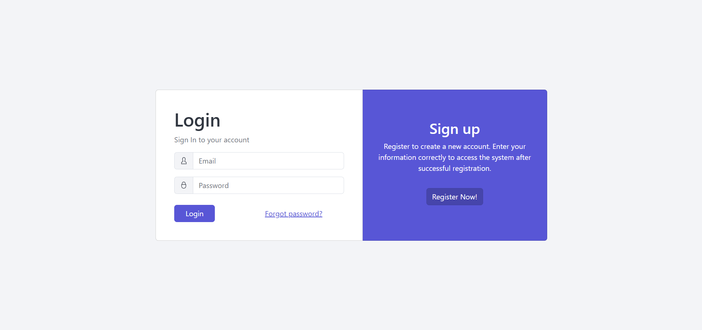
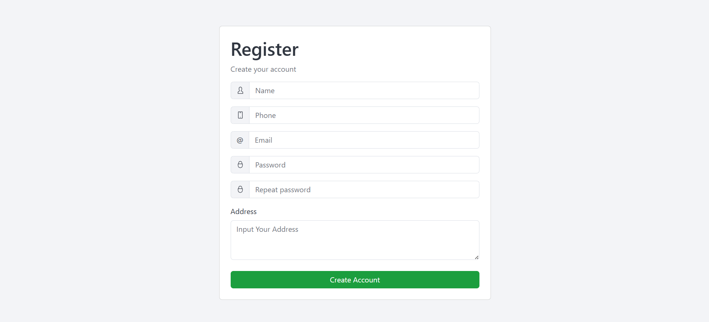
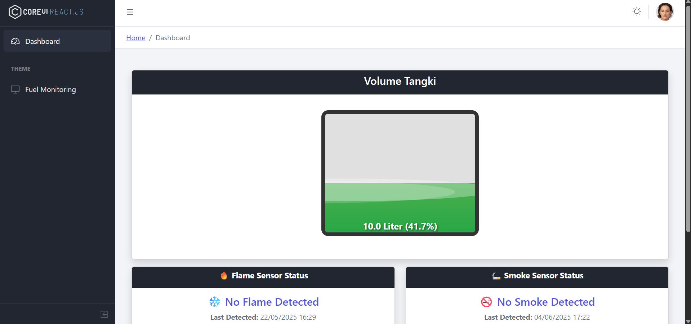
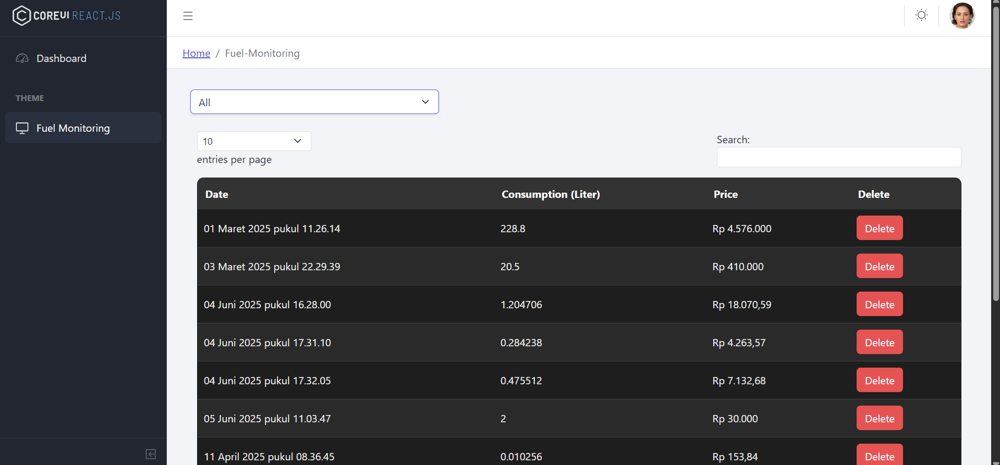
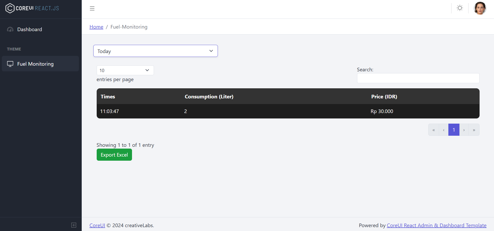
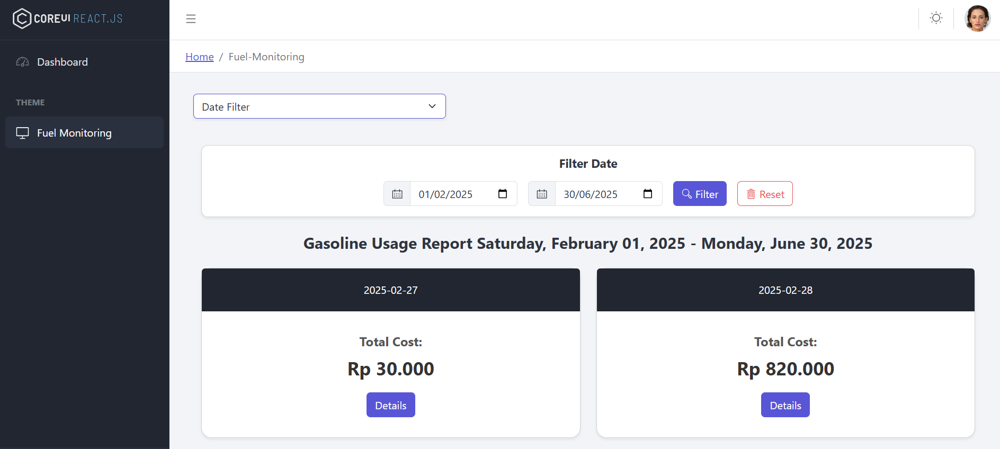
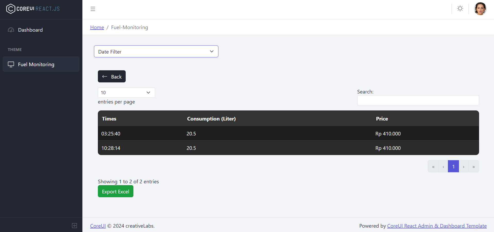
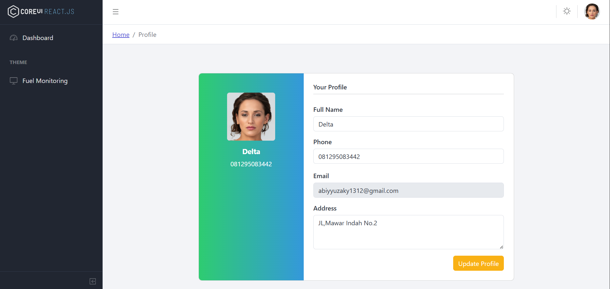

## Frontend Fuel Tank IoT

This Code for Frontend Fuel Tank IoT.

## Showcase?

- Login Page

  

- Register Page

  

- Dashboard Page

  

- All Fuel Monitoring

  

- Today Fuel Monitoring

  

- Filter Date Fuel Monitoring

  

- Detail Filter Monitoring By Date

  

- Profile Page

  

<h2 align="left">Technology Used?</h2>

###

  
   
   
   

###
